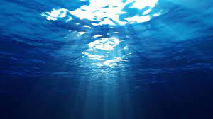

# AI-Powered Water Quality Analysis and Prediction

Harnessing the power of AI technology, the Indian Water Quality Analysis and Prediction project addresses the increasingly dire consequences of water pollution amidst rapid economic growth and urbanization. This innovative solution is designed to not only comprehend the complexities of water quality issues but also to contribute to the reduction and regulation of water pollution. By gaining profound insights into the patterns and challenges associated with water quality, this project serves as a vital tool in mitigating the environmental impact and ensuring the well-being of communities.

<p align="center">
 
</p>

## Overview

<details open="open">
  <summary>Contents </summary>
  <ul>
    <li>
      <a href="#problem-statement">Problem Statement</a>
    </li>
    <li>
      <a href="#objective">Objective</a>
    </li>
    <li>
      <a href="#dataset">Dataset</a>
    </li>
   <li>
      <a href="#data-visualization">Data Visualization</a>
    </li>
    <li>
      <a href="#process-flow">Process Flow</a>
    </li>
    <li>
       <a href="#calculations">Calculations</a>
    </li>
    <li>
      <a href="#model-used">Model Used</a>
    </li>
    <li>
      <a href="#predicted-output">Predicted Output</a>
    </li>
    <li>
      <a href="#library">Libraries</a>
    </li>
     <li>
      <a href="#usage">How to use</a>
    </li>
    <li>
      <a href="#references">References</a>
    </li>
  </ul>
</details>

## problem-statement
🤔
 >Safe and accessible water is crucial for public health across various domains. Predicting water quality changes at different contamination levels is essential for 
  preparation and regulation.

 >This hackathon seeks AI-based solutions that accurately forecast water safety and enable rational strategies to prevent and regulate water contamination

 > Let's harness the power of AI to protect public health and promote sustainable water management practices.
 >
 >

Designated Best Use	Class of Water	Criteria - 
> According to Central Pollution Control Board, Inland  surface water is categorised in 4 different categories, on the basis of use as shown in the table below - 
<table>
 <th> Optimal Utilization Classification </th>
 <th> Class of Water </th>
 <th> Criteria </th>
 <tr> 
   <td>
  
   Disinfection as an Alternative to Conventional Treatment for Drinking Water Sources.
   </td>
  <td>
 A
   </td>
  <td>
1.    Total coliform organisms MPN/100 ml shall be 50(max.) <br>
2.   pH between 6.5 to 8.5 <br>
3.    Dissolved Oxygen (Min) 6 mg/l <br>
4.    BOD (max) 5 days < 2.00 mg/l <br>
   </td>
 </tr>
 
  <tr> 
   <td>
Outdoor bathing(Organised)
   </td>
  <td>
 B
   </td>
  <td>
1.    Total coliform organisms MPN/100 ml shall be 500 (max.)<br>
2.    Fecal Coliform MPN/100 mg. to be 2500 (max.) for Ganga Action Plan.<br>
3.   pH between 6.8 to 8.5.<br>
4.    Dissolved Oxygen (min) 4 mg/l <br>
5.    BOD (Max.) 5 days @ 3 mg/l <br>
   </td>
 </tr>
 
 <tr> 
   <td>
Drinking water with conventional treatment Followed by disinfections
   </td>
  <td>
 C
   </td>
  <td>
1.    Total coliform organisms MPN/100 ml shall be 5000 (max.) <br>
2.    PH between 6.8 to 8.5 <br>
3.    Dissolved Oxygen (min) 4 mg/l <br>
4.    BOD (max.) 5 days @ 3 mg/l <br>
   </td>
 </tr>
 
 <tr> 
   <td>
Propagation of wild life Fisheries.
   </td>
  <td>
 D
   </td>
  <td>
1.    pH between 6.5 to 8.5 <br>
2.    Dissolved Oxygen (min) 4 mg/l. <br>
3.    Free Ammonia (as N) (max)1.2mg/l. <br>
   </td>
 </tr>
 
</table>


## objective
🎯

> The system aims to minimize the consumption of low-quality water, leading to a reduction in diseases like typhoid and diarrhea. 
> 
> By utilizing machine learning techniques, the application distinguishes between safe, drinkable water and non-potable water.
> 
> Our application has the potential to enhance water quality across various water bodies, addressing water pollution concerns.
> 
>  The future potential of the proposed model in predicting Water Quality Index (WQI) can be explored to assess its effectiveness and efficiency


## dataset
📊

>The [dataset](https://www.kaggle.com/anbarivan/indian-water-quality-analysis-and-prediction/data) contains water quality metrics for 3276 different water bodies.
>
> * STATION CODE
> * LOCATION
> * STATE 
> * TEMPERATURE	
> * D.O. (mg/l)	
> * PH	
> * CONDUCTIVITY (mhos/cm)	
> * B.O.D. (mg/l)	
> * NITRATENAN N+ NITRITENANN (mg/l)	
> * FECAL COLIFORM (MPN/100ml)
> * TOTAL COLIFORM (MPN/100ml)
> * YEAR
> <p align="center">
  
  </p>
  
#### Importing Dataset
```
df=pd.read_csv('water_potability.csv')
```
If your notebook and csv files are in different places you can write the whole path to import the file.
```
df=pd.read_csv('../input/water-potability/water_potability.csv')
```

#### Exploratory Data Analysis
Step 1)
```
data.info()
```


Step 2) Converting all non-numerical values to NaN
```
data['Temp']=pd.to_numeric(data['Temp'],errors='coerce')
data['D.O. (mg/l)']=pd.to_numeric(data['D.O. (mg/l)'],errors='coerce')
data['PH']=pd.to_numeric(data['PH'],errors='coerce')
data['B.O.D. (mg/l)']=pd.to_numeric(data['B.O.D. (mg/l)'],errors='coerce')
data['NITRATENAN N+ NITRITENANN (mg/l)']=pd.to_numeric(data['NITRATENAN N+ NITRITENANN (mg/l)'],errors='coerce')
data['TOTAL COLIFORM (MPN/100ml)Mean']=pd.to_numeric(data['TOTAL COLIFORM (MPN/100ml)Mean'],errors='coerce')
data.dtypes
```
Step 3) Checking for NaN Values and removing them
```
data.isna()
data = data.dropna()
```
Step 4) Making the data more presentable and formatting columns
```
data=pd.concat([station,location,state,do,ph,co,bod,na,tc,year],axis=1)
data. columns = ['station','location','state','do','ph','co','bod','na','tc','year']
```
Step 5) Used MS Excel to do intensive formatting in various columns. <br> (Example - There were multiple spelling of same states such as Orissa, Odhisha and Orisha.)

## data-visualization
👀
> The data analysis has been conducted using Tableau
> To access the interactive dashboard, please open the "Water Quality Analysis.twb" file in the Tableau app <br> 
>  (make sure to keep the macros on) <br>


## process-flow
🎞️
> The dataset will be analyzed in the following manner.

 


  
## calculations

> The Water Quality Index (WQI) serves as a measure of water quality, taking into account multiple parameters that impact water quality.
> 
> 
> 
> 
> Please refer to the provided image for the formula used to calculate WQI. In the formula, N represents the total number of parameters considered, qi represents the quality estimate scale for each parameter i (calculated using Formula (2)), and wi represents the unit weight of each parameter (determined by Formula (3)).
> 
> 
> 
> where Vi is a measured value that refers to the water samples tested, VIdeal is an ideal value
> and indicates pure water (0 for all parameters except OD = 14.6 mg/L and pH = 7.0), and
> Si is a traditional value recommended for parameter i, taken from the internet.
> 
> 
> 
> where K denotes the constant of proportionality, which is calculated using the following
> formula:
> 
> 
> 

## model-used
🤖

After performing Exploratory Data Analysis (EDA) and conducting thorough Data Cleaning, we have successfully implemented the ARIMA (Autoregressive Integrated Moving Average) Time Series forecasting technique for predicting the Water Quality Index (WQI). ARIMA is a widely used statistical and econometric method for analyzing and forecasting time series data, enabling us to understand past trends and predict future data points.

Regarding the model performance, please provide specific metrics or evaluation results so that we can elaborate on the effectiveness and accuracy of the ARIMA model in predicting the Water Quality Index.
Model Performance - <br>


<br>
However, after this to improve upon the model, we implemented the Rolling forecast ARIMA (Autoregressive Integrated Moving Average) model. Further Evaluation was done using walk-forward validation and then the forecasts was evaluated.


  
## predicted-output
💯 

> The model's accuracy is being evaluated using K-fold cross-validation.
> 
> The evaluation metrics include RMSE(Root Mean Square Error) and R2 score.
> 
> Ml model can be developed to predict `WQI` by selecting important parameters from a standard dataset precited using machine learning model .
>
> 

## library
📚
> [`numpy`](https://numpy.org/doc/stable/)  adds support for large, multi-dimensional arrays and matrices, along with a large collection of high-level mathematical functions to operate on these arrays.
> 
> [`matplotlib`](https://matplotlib.org/stable/) is a plotting library for the Python programming language and its numerical mathematics extension NumPy. It provides an object-oriented API for embedding plots into applications using general-purpose GUI toolkits.
> 
> [`scipy`](https://scipy.github.io/devdocs/index.html) is used for scientific computing and technical computing. It contains modules for optimization, linear algebra, integration, interpolation, special functions, FFT, signal and image processing, ODE solvers and other tasks.
> 
> [`pandas`](https://pandas.pydata.org/pandas-docs/stable/reference/api/pandas.DataFrame.html) is for data manipulation and analysis. In particular, it offers data structures and operations for manipulating numerical tables and time series.
> 
> [`sklearn`](https://scikit-learn.org/stable/) or scikit-learn features various classification, regression and clustering algorithms and is designed to interoperate with the Python numerical and scientific libraries NumPy and SciPy.

## usage
👓
> The machine learning model can effectively predict the Water Quality Index (WQI) by selectively considering significant parameters from a standardized dataset. By leveraging this model, accurate WQI predictions can be achieved, enhancing our understanding of water quality conditions..
> 
> The robustness and efficiency of the proposed model in predicting WQI can be examined in future works.


## References
🔖

> https://ieeexplore.ieee.org/document/7944943/metrics#metrics
>


<!-- https://www.utc.fr/~jlaforet/Suppl/python-cheatsheets.pdf -->
